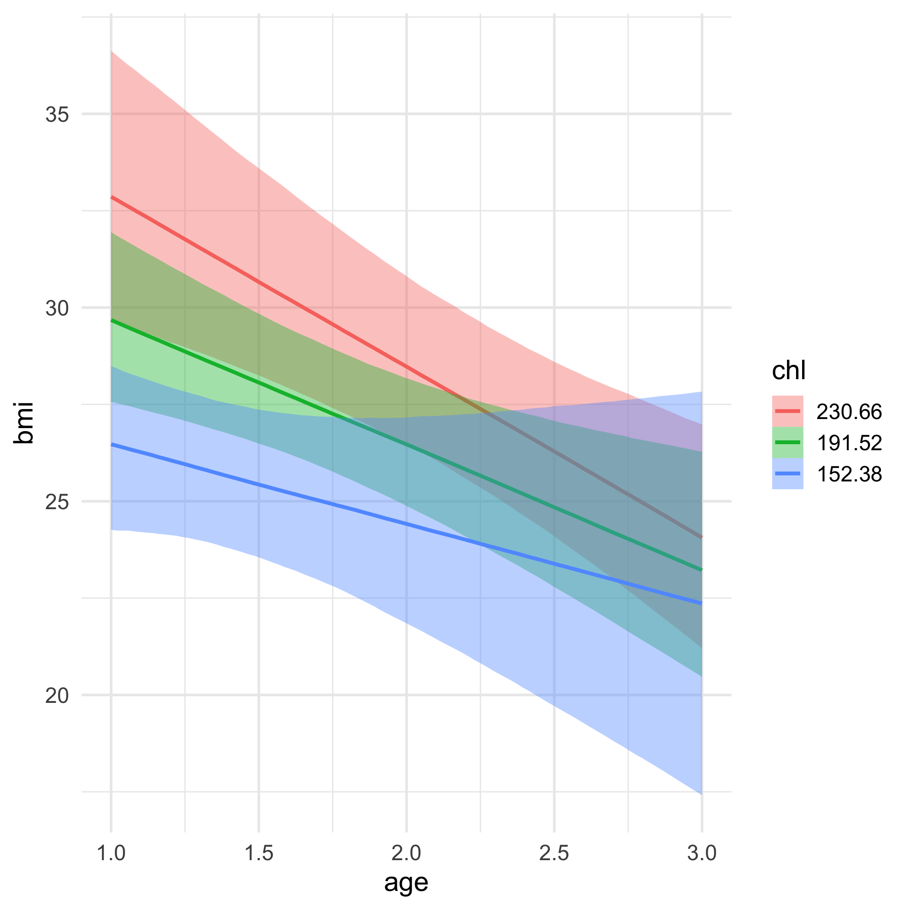

```{r include = FALSE}
source(here::here("static", "slides", "slide-setup.R"))
xaringanExtra::use_clipboard()
library(tidyverse)
theme_set(theme_minimal(25))
library(conflicted)
conflict_prefer("select", "dplyr")
conflict_prefer("filter", "dplyr")
knitr::opts_chunk$set(fig.width = 13, message = FALSE)
update_geom_defaults('path', list(size = 2))
update_geom_defaults('smooth', list(size = 2))
update_geom_defaults('point', list(size = 5))
update_geom_defaults('text', list(size = 9))
```

`r setup("w10p1")`

---
# Agenda
* Review Homework 3

* RQ to models practice

* Finishing up the last bits from last time

* Quick discussion on missing data

* Cross-classified models
  
  + And a brief foray into multiple membership models

Bonus info for you if you want to cover on your own  

* Fitting a 1PL model through a mixed effects framework

---
class: inverse-blue middle
# Review Homework 3

---
class: inverse-blue middle
# Research Questions to models

---
# Data

Read in the `alcohol-adolescents.csv` data. 

`r countdown::countdown(2)`

```{r message = FALSE}
library(tidyverse)
alc <- read_csv(here::here("data", "alcohol-adolescents.csv"))
```

---
# Data

```{r }
alc
```


---
# RQ 1

`r countdown::countdown(2)`

> Does alcohol use increase with age?


--
Actually no *one* right answer, but some are more correct than others.

---
# How I would start

* First, estimate the model that makes the most theoretical sense, to me - random intercepts and slopes

  + If that model fits fine, just go forward with it and interpret

  + If that model does *not* fit well (i.e., convergence warnings), contrast that model with one that constrains the slope to be constant across partcipants
  
---
# Theoretical model

```{r message = FALSE}
library(lme4)
alc <- alc %>% 
  mutate(age_c = age - 14)

rq1a <- lmer(alcuse ~ age_c + (1 + age_c | id),
             data = alc)
```

---
# Model summary

```{r }
summary(rq1a)
```

---
# RQ 2

`r countdown::countdown(2)`

> Do children of alcoholics have higher levels of alcohol use?


--
Keyword here: **levels**

This implies a change in the intercept, not the slope

--
```{r }
rq2 <- lmer(alcuse ~ age_c + coa + (1 + age_c | id),
            data = alc)
```


---
# RQ 3

`r countdown::countdown(2)`

> Do male children of alcoholics have higher alcohol use than female children of alcoholics?

--

Important - we're specifically interested in `coa == 1` cases.


**However**: We have to model main effects for `coa` and `male` to get at `male:coa`.


--

```{r }
rq3 <- lmer(alcuse ~ age_c + coa + male + coa:male +
              (1 + age_c | id),
            data = alc)
```


---
# RQ 4

`r countdown::countdown(2)`

> Do adolescents' alcohol use trajectories differ between males and females?

--
```{r }
rq4 <- lmer(alcuse ~ age_c + male + age_c:male +
              (1 + age_c | id),
            data = alc)
```

---
# RQ 5


`r countdown::countdown(2)`

> Does the trajectory of alcohol use differ for male children of alcoholics than female children of alcoholics?


--
Three-way interaction

```{r }
rq5 <- lmer(alcuse ~ age_c + coa + male + 
              age_c:male + age_c:coa + coa:male +
              age_c:male:coa +
              (1 + age_c | id),
            data = alc)
```

---
# Alternative syntax

This syntax also includes the `coa:male` interaction

```{r }
rq5b <- lmer(alcuse ~ age_c * coa * male + 
              (1 + age_c | id),
            data = alc)
```


---
```{r }
arm::display(rq5)
```

---
```{r }
arm::display(rq5b)
```

---
# New data

`r countdown::countdown(1)`

Load in the `three-lev.csv` data

--
```{r message = FALSE}
threelev <- read_csv(here::here("data", "three-lev.csv"))
threelev
```

---
# RQ 1

> To what extent do math scores, and changes in math scores, vary between students versus between schools?

`r countdown::countdown(1)`

--
This is complicated


--
Two part analysis - first estimate the model, then compute the ICC for the intercept and the ICC for the slope


--
## The model

```{r }
rq1_math <- lmer(math ~ 1 + year + 
                   (year | sid) + (year | schid),
                 data = threelev)
```

---
# Variances

```{r }
as.data.frame(VarCorr(rq1_math))
```


---
# Proportions

```{r }
as.data.frame(VarCorr(rq1_math)) %>% 
  mutate(prop = vcov / sum(vcov))
```

---
# Plot

```{r }
as.data.frame(VarCorr(rq1_math)) %>% 
  mutate(prop = vcov / sum(vcov)) %>% 
  ggplot(aes(grp, prop)) +
  geom_col(aes(fill = var1)) 
```

---
# RQ 2

`r countdown::countdown(2)`

> What is the average difference in math scores among students coded Black or Hispanic, versus those who are not?


--
```{r }
rq2_math <- lmer(math ~ year + black + hispanic +
                   (year | sid) + (year | schid),
                 data = threelev,
                 control = lmerControl(optimizer = "bobyqa"))

```

---
# Last one

`r countdown::countdown(2)`

> To what extent do the differences in gains between students coded Black or Hispanic, versus those who are not, vary between schools?


--
Note - this is a model that is difficult to fit. Bayes might help.

--
```{r }
rq3_math <- lmer(math ~ year + black + hispanic +
                   year:black + year:hispanic +
                   (year | sid) + 
                   (year + year:black + year:hispanic | schid),
                 data = threelev)
```


---

Low variance components make convergence difficult

```{r }
arm::display(rq3_math)
```

---
class: inverse-blue middle

# Finishing up from last class

---
# Reminder
Lung cancer data: Patients nested in doctors

```{r }
hdp <- read_csv("https://stats.idre.ucla.edu/stat/data/hdp.csv") %>% 
  janitor::clean_names() %>% 
  select(did, tumorsize, pain, lungcapacity, age, remission)
hdp
```

---
# Predict remission
Build a model where age, lung capacity, and tumor size predict whether or not the patient was in remission. 

* Build the model so you can evaluate whether or not the relation between the tumor size and likelihood of remission depends on age

* Allow the intercept to vary by the doctor ID. 

* Fit the model using **brms**


---
# Lung cancer remission model

```{r message = FALSE}
library(brms)
lc <- brm(
  remission ~ age * tumorsize + lungcapacity + (1|did),
  data = hdp,
  family = bernoulli(link = "logit"),
  cores = 4,
  backend = "cmdstan"
)
```


---
# Variance by Doctor
Let's look at the relation between age and probability of remission for each of the first nine doctors.

--

```{r}
library(tidybayes)
pred_age_doctor <- expand.grid(
    did = 1:9,
    age = 20:80,
    tumorsize = mean(hdp$tumorsize),
    lungcapacity = mean(hdp$lungcapacity)
  ) %>% 
  add_fitted_draws(model = lc, n = 100)
```

---
```{r }
pred_age_doctor
```

---
```{r fig.height = 9}
ggplot(pred_age_doctor, aes(age, .value)) +
  geom_line(aes(group = .draw), alpha = 0.2) +
  facet_wrap(~did)
```

---
# Look at our variables

```{r }
get_variables(lc)
```

---
# Multiple comparisons
One of the nicest things about Bayes is that any comparison you want to make can be made without jumping through a lot of additional hoops (e.g., adjusting $\alpha$).


--
### Scenario
Imagine a **35** year old has a tumor measuring **58 millimeters** and a lung capacity rating of **0.81**.


--
What would we estimate as the probability of remission if this patient had `did == 1` versus `did == 2`?


---
# Fixed effects

Not really "fixed", but rather just average relation

```{r }
fe <- lc %>% 
  spread_draws(b_Intercept, b_age, b_tumorsize, b_lungcapacity, 
               `b_age:tumorsize`)
fe
```

---
# Data
```{r }
age <- 35
tumor_size <- 58
lung_cap <- 0.81
```

--
Population-level predictions (there's other ways we could do this, but it's good to remind ourselves the "by hand" version too)

```{r }
pop_level <- 
  fe$b_Intercept +
  (fe$b_age * age) +
  (fe$b_tumorsize * tumor_size) +
  (fe$b_lungcapacity * lung_cap) +
  (fe$`b_age:tumorsize` * (age * tumor_size))
pop_level
```

---
# Plot population level

```{r fig.height = 6}
pd <- tibble(population_level = pop_level) 

ggplot(pd, aes(population_level)) +
  geom_histogram(fill = "#61adff",
                 color = "white") +
  geom_vline(xintercept = median(pd$population_level),
             color = "magenta",
             size = 2)
```

---
# Add in did estimates

```{r }
dids <- spread_draws(lc, r_did[did, ])

did1 <- filter(dids, did == 1)
did2 <- filter(dids, did == 2)

pred_did1 <- pop_level + did1$r_did
pred_did2 <- pop_level + did2$r_did
```

---
# Distributions

```{r }
did12 <- tibble(did = rep(1:2, each = length(pred_did1)),
                pred = c(pred_did1, pred_did2))

did12_medians <- did12 %>% 
  group_by(did) %>% 
  summarize(did_median = median(pred))

did12_medians
```

---
# Plot
```{r fig.height = 6}
ggplot(did12, aes(pred)) +
  geom_histogram(fill = "#61adff",
                 color = "white") +
  geom_vline(aes(xintercept = did_median), data = did12_medians,
             color = "magenta",
             size = 2) +
  facet_wrap(~did, ncol = 1)
```

---
# Transform
Let's look at this again on the probability scale using `brms::inv_logit_scaled()` to make the transformation.

--
```{r eval = FALSE}
ggplot(did12, aes(inv_logit_scaled(pred))) +
  geom_histogram(fill = "#61adff",
                 color = "white") +
  geom_vline(aes(xintercept = inv_logit_scaled(did_median)), 
             data = did12_medians,
             color = "magenta",
             size = 2) +
  facet_wrap(~did, ncol = 1)
```

---
```{r echo = FALSE}
ggplot(did12, aes(inv_logit_scaled(pred))) +
  geom_histogram(fill = "#61adff",
                 color = "white") +
  geom_vline(aes(xintercept = inv_logit_scaled(did_median)), 
             data = did12_medians,
             color = "magenta",
             size = 2) +
  facet_wrap(~did, ncol = 1)
```

---
# Difference
* The difference in the probability of remission for our theoretical patient is large between the two doctors.

* The median difference in log-odds is

```{r }
diff(did12_medians$did_median)
```

---
# Exponentiation
We can exponentiate the log-odds to get normal odds

These are fairly interpretable (especially when greater than 1) 

```{r }
# probability
inv_logit_scaled(did12_medians$did_median)

# odds
exp(did12_medians$did_median)

# odds of the difference
exp(diff(did12_medians$did_median))
```

---
class: middle

We estimate that our theoretical patient is about `r round(exp(diff(did12_medians$did_median)))` times **more likely** (!) to go into remission if they had `did` 2, instead of 1.

---
# Confidence in difference?
### Everything is a distribution
Just compute the difference in these distributions, and we get a new distribution, which we can use to summarize our uncertainty

--
```{r }
did12_wider <- tibble(
  did1 = pred_did1, 
  did2 = pred_did2
) %>% 
  mutate(diff = did2 - did1)

did12_wider
```

---
# Summarize

```{r }
qtile_diffs <- quantile(did12_wider$diff, 
                        probs = c(0.025, 0.5, 0.975))

exp(qtile_diffs)
```


---
# Plot distribution
Show the most likely 95% of the distribution

```{r fig.height = 4}
# filter a few extreme observations
did12_wider %>% 
  filter(diff > qtile_diffs[1] & diff < qtile_diffs[3]) %>% 
ggplot(aes(exp(diff))) +
  geom_histogram(fill = "#61adff",
                 color = "white",
                 bins = 100)
```

---
# Directionality
Let's say we want to simplify the question to directionality.


--
Is there a greater chance of remission for `did` 2 than 1?

--
```{r }
table(did12_wider$diff > 0) / 4000
```


--
The distributions are not overlapping at all - therefore, we are as certain as we can be that the odds of remission are higher with `did` 2 than 1.


---
# One more quick example
Let's do the same thing, but comparing `did` 2 and 3.

```{r }
did3 <- filter(dids, did == 3)
pred_did3 <- pop_level + did3$r_did

did23 <- did12_wider %>% 
  select(-did1, -diff) %>% 
  mutate(did3 = pred_did3,
         diff = did3 - did2)
did23
```

---
# Directionality

```{r }
table(did23$diff > 0) / 4000
```

So there's roughly an `r paste0(round((table(did23$diff > 0) / 4000)[2], 2)*100, "%")` chance that the odds of remission are higher with with `did` 3 than 2.

---
# Plot data

```{r }
pd23 <- did23 %>% 
  pivot_longer(did2:diff, 
               names_to = "Distribution",
               values_to = "Log-Odds")
pd23
```

---
```{r fig.height = 8.5}
ggplot(pd23, aes(`Log-Odds`)) +
  geom_histogram(fill = "#61adff",
                 color = "white") +
  facet_wrap(~Distribution, ncol = 1)
```

---
# Probability scale
```{r fig.height = 6}
pd23 %>% 
  mutate(Probability = inv_logit_scaled(`Log-Odds`)) %>% 
ggplot(aes(Probability)) +
  geom_histogram(fill = "#61adff",
                 color = "white") +
  facet_wrap(~Distribution, ncol = 1)
```


---
class: inverse-red middle
# Break

`r countdown::countdown(5)`


---
class: inverse-blue middle
# Missing data

---
# Disclaimer
* Missing data is a **massive** topic 

* I'm hoping/assuming you've covered it some in other classes

* This is mostly about implementation options

---
# Missing data on the DV

* Mostly what we tend to talk about in classes

* Also regularly the least problematic

* If we can assume MAR (missing at random conditional on covariates), most modern models do a pretty good job

---
# Missing data on the IVs

* Much more problematic, no matter the model or application

* Remove all cases with any missingness on any IV? 

  + Limits your sample size
  
  + Might (probably?) introduces new sources of bias
  
* Impute?

  + Often ethical challenges here - do you really want to impute somebody's gender?
  

---
background-image: url(https://media0.giphy.com/media/fCm976YD6jQ9q/giphy.gif?cid=790b7611bce089ec3c02d3f6cb5c42ddc75605f83926d8c7&rid=giphy.gif&ct=g)
background-size: contain

---
# Solution?

* There really isn't a great one. Be clear about the decisions you do make.

* If you do choose imputation, use multiple imputation

  + This will allow you to have uncertainty in your imputation
  
* The purpose is to get unbiased population estimates for your parameters (not make inferences about an individual for whom data were imputed)

---
# Missing IDs

* In multilevel models, you always have IDs linking the data to the higher levels

* If you are missing these IDs, I'm not really sure what to tell you

  + This is particularly common with longitudinal data (e.g., missing prior school IDs)
  
  + In rare cases, you can make assumptions and impute, but those are few and far between, in my experience, and the assumptions are still pretty dangerous
  
---
# Let's do it

### Multiple imputation

This part is general, and not specific to multilevel modeling


--
First, install/load the **{mice}** package (you might also check out **{Amelia}**)

```{r message = FALSE}
library(mice)
```

---
# Data
We'll impute data from the `nhanes` dataset, which comes with **{mice}**

```{r }
head(nhanes)
```

---
# How much missingness

A lot

```{r }
#install.packages("naniar")
naniar::vis_miss(nhanes)
```

---
# Multiple imputation
* First, we're going to create 5 new dataset, each one with the missing data imputed

```{r }
mi_nhanes <- mice(nhanes, m = 5, print = FALSE)
```

---
# MI for BMI

```{r }
mi_nhanes$imp$bmi
```

---
# Fit model w/brms
Now just feed the **{mice}** object to `brms::brm_multiple()` as your data. 

Note - this is considerably easier than it is with **lme4**, but it is do-able

```{r eval = FALSE}
m_mice <- brm_multiple(bmi ~ age * chl, 
                       data = mi_nhanes)
```

---
# Alternative

* A neat thing we can do with Bayes, is to impute *on the fly* using the posterior 

* We still get uncertainty because of the repeated samples we're taking from the posterior anyway

* With **{brms}**, we can do this by just passing a slightly more complicated formula

---
# Missing formula

We specify a model for each column that has missingness

--

We have missing data in `bmi` and `chl` (not `age`).


--
`bmi` is our outcome, and it will be modeled by `age` and the *complete* (missing data imputed) `chl` variable, as well as their interaction


--
The missing data in `chl` will be imputed via a model with `age` as its predictor!

We're basically fitting two models at once.

---
# In Code

The `| mi()` part says to include missing data

```{r eval = FALSE}
bayes_impute_formula <- 
  bf(bmi | mi() ~ age * mi(chl)) +  # base model
  bf(chl | mi() ~ age) + # model for chl missingness
  set_rescor(FALSE) # we don't estimate the residual correlation
```

---
# Fit

```{r eval = FALSE}
m_onfly <- brm(bayes_impute_formula, data = nhanes)
```

---
# Comparison

Multiple imputation before modeling

```{r eval = FALSE}
conditional_effects(m_mice, "age:chl", resp = "bmi")
```

```{r echo = FALSE, out.height = "50%", out.width = "50%"}

```


---
# Comparison

Imputation during modeling

```{r eval = FALSE}
conditional_effects(m_onfly, "age:chl", resp = "bmi")
```

```{r echo = FALSE, out.height = "50%", out.width = "50%"}
knitr::include_graphics("img/onfly_results.png")
```


---
class: inverse-blue middle

# Cross classified models

---
# Nested model


---
# Crossed


---
# Fitting models

## First, look at the data
```{r }
library(lme4)

Penicillin <- Penicillin %>% 
  arrange(sample)

head(Penicillin)
```

---
# Nested model
```{r }
nested1 <- lmer(diameter ~ 1 + (1 | sample), 
                data = Penicillin)
```

---
# Nested image

```{r }
library(sundry)
pull_residual_vcov(nested1) %>% 
  image()
```

---
# Crossed model

```{r fig.height = 5}
Penicillin <- Penicillin %>% 
  arrange(plate)

crossed1 <- lmer(diameter ~ 1 + (1 | sample) + (1|plate), 
                 data = Penicillin)

pull_residual_vcov(crossed1) %>% 
  image()
```


---
# Closer look

```{r }
pull_residual_vcov(crossed1)[1:12, 1:12] %>% 
  image()
```

---
# Second example

```{r }
data(Oxide, package = "nlme")
head(Oxide)
```

---
# Nested

This data actually are nested

```{r fig.height = 6.5}
nested2 <- lmer(Thickness ~ 1 + (1|Lot/Wafer), data = Oxide)
pull_residual_vcov(nested2) %>% 
  image()
```

---
# Errant crossing

```{r }
crossed2 <- lmer(Thickness ~ 1 + (1|Lot) + (1|Wafer), 
                 data = Oxide)
pull_residual_vcov(crossed2) %>% 
  image()
```

---
# Fix
I tend to like to fix the *data*, so the model is the same regardless of the model syntax.

--
```{r fig.height = 4}
Oxide <- Oxide %>% 
  mutate(Wafer = paste0(Lot, Wafer))

nested3 <- lmer(Thickness ~ 1 + (1|Lot) + (1|Wafer), 
                 data = Oxide)
pull_residual_vcov(nested3) %>% 
  image()
```

---
# Compare

### Nested syntax

```{r }
summary(nested2)
```

---
# Compare

### Explicit IDs

```{r }
summary(nested3)
```

---
class: inverse-red middle
# Switching schools

See [this](https://journal.r-project.org/archive/2018/RJ-2018-017/RJ-2018-017.pdf) paper for more complete information

---
# The data
Primary and secondary schools

```{r message = FALSE}
achievement <- read_csv(here::here("data", "pupils.csv"))
achievement
```

---
# About the data
Students transitioned from primary to secondary schools

We don't know how long they spent in each

It's logical to assume that scores would vary across both primary and secondary schools

How do we model this?

Cross-classified model!

---
```{r }
ccrem <- lmer(achievement ~ 1 + 
                (1|primary_school_id) + (1|secondary_school_id),
              data = achievement)

arm::display(ccrem)
```

---
# Random effects
Note that each random effect would be added to each person's score. This is a little complicated.

```{r }
str(ranef(ccrem))
```

---
# Image

```{r }
pull_residual_vcov(ccrem) %>% 
  image()
```

---
# Zoomed in

```{r }
pull_residual_vcov(ccrem)[1:50, 1:50] %>% 
  image()
```

---
class: inverse-orange middle

# Multiple membership models

---
# MM alternative

If we use **{brms}** instead, we can estimate a *multiple membership* model. 

In this case, we would estimate a single random component for *school*, which would be a weighted component of each school the student attended

---
# Fitting MM

```{r eval = FALSE}
mm_brms <- brm(
  achievement ~ 1 + 
    (1 | mm(primary_school_id, secondary_school_id)),
  data = achievement
)
```

---
```{r eval = FALSE}
summary(mm_brms)
```


---
# More complications
What if we knew how long they spent in each school?

Let's pretend we do? 


--
Create new columns for the prortion of time spent in each school. 

I'll just do this randomly.

---
# Random proportion variables

```{r }
set.seed(42)
achievement <- achievement %>% 
  mutate(primary_school_time = abs(rnorm(1000)),
         secondary_school_time = abs(rnorm(1000))) %>% 
  rowwise() %>% 
  mutate(tot = primary_school_time + secondary_school_time,
         primary_school_time = primary_school_time / tot,
         secondary_school_time = secondary_school_time / tot) %>% 
  ungroup()

achievement %>% 
  select(PUPIL, ends_with("time"))
```

---
# Include the weights

```{r eval = FALSE}
mm_brms2 <- brm(
  achievement ~ 1 + 
    (1 | mm(primary_school_id, secondary_school_id,
            weights = cbind(primary_school_time, 
                            secondary_school_time))),
  data = achievement)
```

---
```{r eval = FALSE}
summary(mm_brms2)
```


---
class: inverse-blue middle
# One PL IRT model

---
# More info

We won't really be able to get too far. Here's some additional resources

* [Paper](https://www.jstatsoft.org/article/view/v020i02) on using **{lme4}** to fit a multilevel Rasch model

* [Paper](https://www.jstor.org/stable/1435439?seq=1) on the equivalence of multilevel logistic regression and Rasch models.

* [Chapter](https://m-clark.github.io/sem/item-response-theory.html) contrasting some of what we'll go through here.

---
# The idea

* Students respond to a set of items, each scored correct/incorroct (0/1)

* Each item has a different difficulty

* Each person has a different ability

* Treat items as fixed effects and people as random effects

---
# The data

A rural subsample of 8445 women from the Bangladesh Fertility Survey of 1989

The dimension of interest is women's mobility of social freedom. 

---
# Items
Women were asked whether they could engage in the following activities alone (1 = yes, 0 = no):  
    
* Item 1: Go to any part of the village/town/city
* Item 2: Go outside the village/town/city
* Item 3: Talk to a man you do not know
* Item 4: Go to a cinema/cultural show
* Item 5: Go shopping
* Item 6: Go to a cooperative/mothers' club/other club
* Item 7: Attend a political meeting
* Item 8: Go to a health centre/hospital

---
# Read in the data

```{r message = FALSE}
mobility <- read_csv(here::here("data", "mobility.csv"))
mobility
```

---
# Restructuring

* The format the data came in with is common for item response data. 

* This won't work for `lme4`


--
* Move to long

---
```{r }
mobility_l <- mobility %>% 
  pivot_longer(-id,
               names_to = "item",
               values_to = "response")
mobility_l
```

---
# Estimate the model

```{r }
onepl <- glmer(response ~ 0 + item + (1|id),
               data = mobility_l,
               family = binomial(link = "logit"),
               control = glmerControl(optimizer = "bobyqa"))
```

---
# Item estimates

```{r }
library(ltm)
ltm_onepl <- rasch(mobility[ ,-1])
tibble(
  lme4_ests = fixef(onepl),
  ltm_ests = ltm_onepl$coefficients[ ,1]
)
```


---
# Person estimates


```{r }
ltm_theta <- factor.scores(ltm_onepl, 
                           resp.patterns = mobility[ ,-1])
ltm_discrim <- unique(ltm_onepl$coefficients[ ,2])

lme4_theta <- ranef(onepl)$id

theta_compare <- tibble(
  ltm_theta = ltm_discrim*ltm_theta$score.dat$z1,
  lme4_theta = lme4_theta[ ,1]
)
theta_compare
```

---
# Discrimination estimate

```{r }
unique(ltm_onepl$coefficients[ ,2])
VarCorr(onepl)
```

---
# Extensions

Thinking about an IRT model through this framework allows us to extend the model easily - we could incorporate higher levels, more predictors, etc.

---
class: inverse-green middle
# That's it!
Thanks so much for a great term