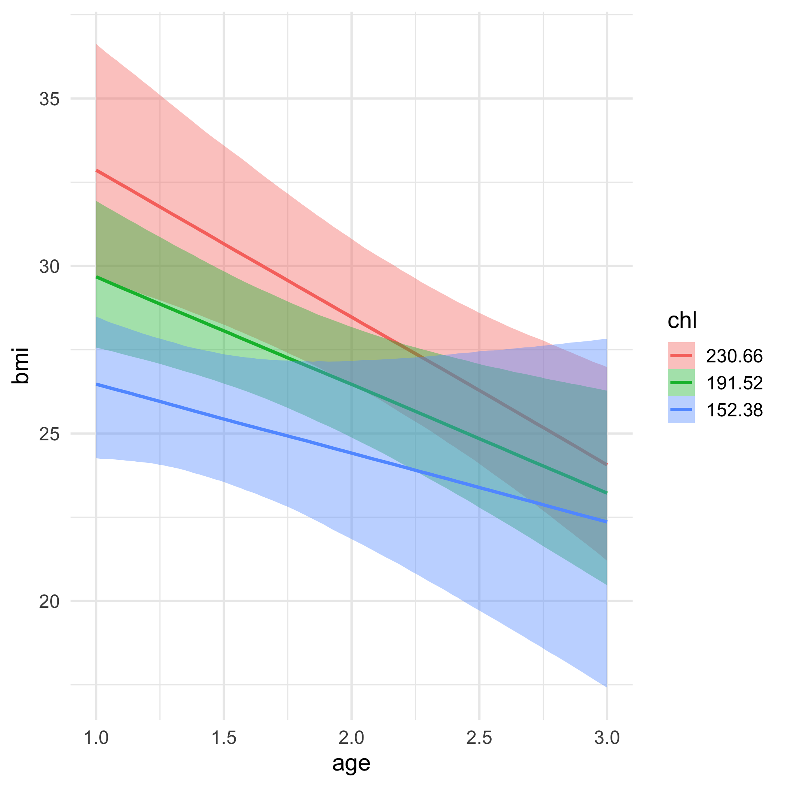
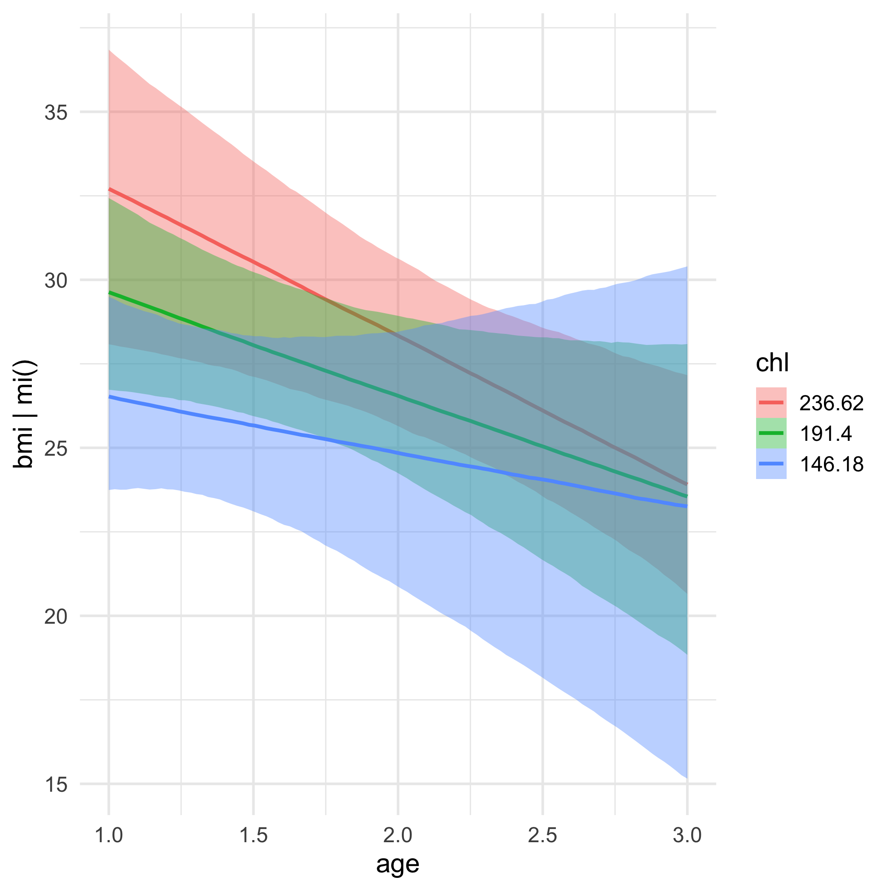

```{r include = FALSE}
source(here::here("static", "slides", "slide-setup.R"))
xaringanExtra::use_clipboard()
library(tidyverse)
theme_set(theme_minimal(25))
knitr::opts_chunk$set(fig.width = 13, message = FALSE)
update_geom_defaults('path', list(size = 2))
update_geom_defaults('smooth', list(size = 2))
update_geom_defaults('point', list(size = 5))
update_geom_defaults('text', list(size = 9))
```

`r setup("w9p1")`

---
# Agenda
* Equation practice

* Fitting multilevel logistic regression models with **brms**
  
  + Applied walkthrough 1: Twitter data
  
  + Applied walkthrough 2: Lung cancer data

* Missing values 

---
class: inverse-blue middle
# Equation practice

---
# Data

Read in the `nurses.csv` data. Note - each row represents data for one nurse. 

`r countdown::countdown(2)`

```{r message = FALSE}
library(tidyverse)
nurses <- read_csv(here::here("data", "nurses.csv"))
```

---
# Data

```{r }
nurses
```


---
# Model 1
Fit the following model

```{r echo = FALSE, message = FALSE}
library(equatiomatic)
library(lme4)
m1 <- lmer(stress ~ experien * wardtype + (experien|wardid),
           data = nurses)
extract_eq(m1, font_size = "small")
```

`r countdown::countdown(2)`

--

```{r eval = FALSE}
lmer(stress ~ experien * wardtype + (experien|wardid),
     data = nurses)

# or
lmer(stress ~ experien + wardtype + experien:wardtype + 
       (experien|wardid),
     data = nurses)
```

---
# Model 2

Fit the following model

```{r echo = FALSE, message = FALSE, warning = FALSE}
m2 <- lmer(stress ~ experien * wardtype + hospsize +
             (experien|wardid) + (experien|hospital),
           data = nurses)
extract_eq(m2, font_size = "scriptsize")
```

`r countdown::countdown(2)`

--

```{r eval = FALSE}
lmer(stress ~ experien * wardtype + hospsize +
       (experien|wardid) + (experien|hospital),
     data = nurses)
```

---
# Model 3

Fit the following model

```{r echo = FALSE, message = FALSE, warning = FALSE}
m3 <- lmer(stress ~ experien + age + expcon +
             (experien||wardid) + (experien||hospital),
           data = nurses)
extract_eq(m3, font_size = "small")
```

`r countdown::countdown(2)`

--

```{r eval = FALSE}
lmer(stress ~ experien + age + expcon +
       (experien||wardid) + (experien||hospital),
     data = nurses)

# or

lmer(stress ~ experien + age + expcon +
       (1|wardid) + (0 + experien|wardid) + 
       (1|hospital) + (0 + experien|hospital),
     data = nurses)
```


---
# Model 4

Fit the following model

```{r echo = FALSE, message = FALSE, warning = FALSE}
m4 <- lmer(stress ~ experien * hospsize + age + expcon + wardtype + 
             (experien|wardid) + (experien|hospital),
           data = nurses)
extract_eq(m4, font_size = "scriptsize")
```

`r countdown::countdown(2)`


--

```{r eval = FALSE}
lmer(stress ~ experien * hospsize + age + expcon + wardtype + 
       (experien|wardid) + (experien|hospital),
     data = nurses)
```

---
# Model 5

Fit the following model

```{r echo = FALSE, message = FALSE, warning = FALSE, cache = TRUE}
nurses <- nurses %>% 
  mutate(expcon = factor(expcon))

m5 <- glmer(expcon ~ age + 
             (age|wardid) + (1|hospital),
           data = nurses,
           family = binomial(link = "logit"))

extract_eq(m5, font_size = "small")
```

`r countdown::countdown(3)`

--
```{r eval = FALSE}
nurses <- nurses %>% 
  mutate(expcon = factor(expcon))

glmer(expcon ~ age + 
        (age|wardid) + (1|hospital),
      data = nurses,
      family = binomial(link = "logit"),
      data = nurses)
```

---
# Model 6

Fit the following model

```{r cache = TRUE, echo = FALSE, warning = FALSE}
m6 <- glmer(expcon ~ hospsize + age + wardtype + 
             (age|wardid) + (1|hospital),
           data = nurses,
           family = binomial(link = "logit"))
extract_eq(m6, font_size = "scriptsize")
```

`r countdown::countdown(2)`

--
```{r eval = FALSE}
glmer(expcon ~ hospsize + age + wardtype + 
        (age|wardid) + (1|hospital),
      data = nurses,
      family = binomial(link = "logit"))
```


---
# Model 7

Fit the following model

```{r cache = TRUE, echo = FALSE, warning = FALSE}
m7 <- glmer(expcon ~ age * gender + wardtype + hospsize +
             (age|wardid) + (age|hospital),
           data = nurses,
           family = binomial(link = "logit"))
extract_eq(m7, font_size = "scriptsize")
```

`r countdown::countdown(2)`

--
```{r eval = FALSE}
glmer(expcon ~ age * gender + wardtype + hospsize +
        (age|wardid) + (age|hospital),
      data = nurses,
      family = binomial(link = "logit"))
```


---
# Model 8

Fit the following model

```{r cache = TRUE, echo = FALSE, warning = FALSE}
m8 <- glmer(expcon ~ age + gender + experien * wardtype + experien * hospsize +
             (experien|wardid) + (experien|hospital),
           data = nurses,
           family = binomial(link = "logit"))
extract_eq(m8, font_size = "scriptsize")
```

`r countdown::countdown(2)`

--
```{r eval = FALSE}
glmer(expcon ~ age + gender + 
        experien * wardtype + experien * hospsize +
        (experien|wardid) + (experien|hospital),
      data = nurses,
      family = binomial(link = "logit"))
```

---
class: inverse-blue middle
# An applied example

---
# The data
## Twitter!

* Real data, collected Wednesday, but anonymized

* You can see the code I used to get the data, but you'll pull different data if you run it

* 18,000 tweets including the hashtag [#blm](https://twitter.com/hashtag/blm)

* Sentence-level text coded for sentiment using the [**{sentimentr}**](https://github.com/trinker/sentimentr) package, then averaged for the entire tweet

---
# Data prep

* Tweets of exactly 0 (neutral) sentiment removed

* Collapsed to positive/negative sentiment

* A few other features pulled out too (e.g., is trump mentioned in the person's bio)


---
# Read in the data
It's a little different because there's still a list column of hashtags. Use code like the following:

```{r}
library(tidyverse)
blm <- read_rds(here::here("data", "blm_sentiment.Rds"))
blm
```

---
# Getting more info

This is a data frame like any other with one exception - the `hashtags` column is a list.


--
See all hashtags

```{r }
blm %>% 
  unnest(hashtags) %>% 
  count(hashtags, sort = TRUE) # %>% 
# View()
```

---
# List column

We can `unnest()` to see all of them, but we can't use that in modeling

--
## Pull more features

Let's get the number of hashtags in the tweet

```{r }
blm <- blm %>% 
  rowwise() %>% 
  mutate(n_hashtags = length(hashtags)) %>% 
  ungroup() 
  
blm %>% 
  select(user_id, n_hashtags)
```

---
# Antifa hashtag?

```{r }
blm <- blm %>% 
  rowwise() %>% 
  mutate(has_antifa_hashtag = any(
    grepl("antifa", tolower(hashtags))
    )
  ) %>% 
  ungroup() 

blm %>% 
  count(has_antifa_hashtag)
```

---
# Data exploration
Can we use some of these features to predict whether the sentiment of the tweet is positive?

--
Let's explore the data some. First, look at the outcome:

```{r fig.height = 5}
ggplot(blm, aes(is_positive_sentiment)) +
  geom_histogram()
```

---
# What about `trump_in_description`?

```{r fig.height = 6}
trump_proportions <- blm %>% 
  mutate(sentiment = ifelse(
    is_positive_sentiment > 0, "Positive", "Negative"
    )
  ) %>% 
  count(trump_in_description, sentiment) %>% 
  group_by(trump_in_description) %>% 
  mutate(proportion = n/sum(n))
trump_proportions
```

---
# Visualize it

```{r }
library(colorspace)
ggplot(trump_proportions, aes(trump_in_description, sentiment)) +
  geom_tile(aes(fill = proportion)) +
  scale_fill_continuous_sequential(palette = "Purples 3", limits = c(0, 1)) +
  facet_wrap(~sentiment, scales = "free_y")

```

---
# Quick skim
Particularly when you're working with data that you're not **super** familiar with, `skimr::skim()` can be really helpful. Try it now!

```{r eval = FALSE}
# install.packages("skimr")
skimr::skim(blm)
```

---
# Distributions
Notice from `skimr::skim()` that some of the distributions are *highly* skewed, e.g., `followers_count`. 

Can transformations help? Give it a try and see what you think

`r countdown::countdown(2)`

```{r fig.height = 4}
ggplot(blm, aes(followers_count)) +
  geom_histogram()
```

---
# Log transformation

Note - it's not strictly neccessary for these to be normally distributed, but it can often help with estimation (while also potentially hurting interpretation, unless you're careful)

```{r fig.height = 4, warning = FALSE}
ggplot(blm, aes(log(followers_count))) +
  geom_histogram()
```

---
# Account creation
In reality I would probably explore my data for a bit longer, unless I already knew a lot about out. For now, let's just do one more, looking at the relation between when their account was created, and whether the sentiment was positive.

--

```{r fig.height = 4}
ggplot(blm, aes(account_created_at, factor(is_positive_sentiment))) +
  geom_jitter(width = 0, 
              alpha = 0.05)
```

---
# Recent accounts only

Maybe a little bit of evidence...

```{r }
blm %>% 
  filter(account_created_at > lubridate::mdy("01/01/2020")) %>% 
  ggplot(aes(account_created_at, factor(is_positive_sentiment))) +
  geom_jitter(width = 0, alpha = 0.2)
```

---
# Last bit
### Sample size issues
The number of **tweets per person** varies a lot. 

* When $n = 1$ it's not theoretically a problem, although I've had issues with estimation in the past. 

* You might consider including the number of tweets a person as a predictor. 
  
  + Could be an indicator they are a bot or a journalist.

.footnote[See [here](https://stats.stackexchange.com/a/482562) for more information]

---
```{r }
blm %>% 
  count(user_id) %>% 
  ggplot(aes(n)) +
  geom_histogram()
```


---
class: inverse-red middle
# Modeling

---
# Person-variance

We have lots of tweets from lots of people - maybe we start by modeling the baseline variability in sentiment across people?


--
`r countdown::countdown(2)`

You try first - go ahead and just use **{lme4}** and then we'll replicate it with **{brms}**

---
# Maximum likelihood version

```{r }
library(lme4)
m0_ml <- glmer(is_positive_sentiment ~ 1 + (1|user_id),
               data = blm,
               family = binomial(link = "logit"))
arm::display(m0_ml)
```

---
# Interpretation
The baseline log-odds of a positive tweet was -0.40. The `brms::inv_logit_scaled()` function will translate it to probability.

--
```{r }
brms::inv_logit_scaled(fixef(m0_ml))
```

--
So about a 40% chance. 


---
# Variability
The log-odds varied between people with a standard deviation of 0.95.

The probability of a person one standard deviation above and below the average posting a positive tweet were estimated at:

```{r }
# Probability for an individual 1 SD below
brms::inv_logit_scaled(-0.40 - 0.95)

# Probability for an individual 1 SD above
brms::inv_logit_scaled(-0.40 + 0.95)
```

---
# Plot the variability

First pull the random effect estimates (deviations from the fixed effect)

```{r }
library(broom.mixed)
tidy_m0_ml <- tidy(m0_ml, "ran_vals", conf.int = TRUE) %>% 
  mutate(level = fct_reorder(level, estimate))
```

--

Next create the plot

```{r eval = FALSE}
ggplot(tidy_m0_ml, aes(estimate, level)) +
  geom_linerange(aes(xmin = conf.low, xmax = conf.high),
                 alpha = 0.01) +
  geom_point(color = "#1DA1F2") +
  
  # get rid of some plot elements
  theme(axis.text.y = element_blank(),
        axis.title.y = element_blank(),
        panel.grid.major.y = element_blank(),
        panel.grid.minor = element_blank())
```

---
# Plot the variability

```{r echo = FALSE, fig.height = 10}
ggplot(tidy_m0_ml, aes(estimate, level)) +
  geom_linerange(aes(xmin = conf.low, xmax = conf.high),
                 alpha = 0.01) +
  geom_point(color = "#1DA1F2") +
  theme(axis.text.y = element_blank(),
        axis.title.y = element_blank(),
        panel.grid.major.y = element_blank(),
        panel.grid.minor = element_blank())
```

---
# Fitting with {brms}

We would probably actually just pick a framework and go with that, **but**, in my experience, multilevel binomial models often have a hard time with convergence. Bayes can help with that.


--
Let's re-fit with **{brms}**


---
# Fit using Bayes

You try first. Fit the same model using Bayes. Go ahead and assume flat priors.

`r countdown::countdown(4)`

--

```{r, message = FALSE}
library(brms)
m0_b <- brm(is_positive_sentiment ~ 1 + (1|user_id),
            data = blm,
            family = bernoulli(link = "logit"),
            cores = 4, 
            backend = "cmdstanr")
```

---
# Summary
Notice the variance is fairly different here

```{r }
summary(m0_b)
```

---
# Posterior predictive

```{r }
pp_check(m0_b, type = "bars")
```

---
# Convergence checks

```{r }
plot(m0_b)
```

---
# Posteriors

```{r }
library(insight)
m0_posterior <- get_parameters(m0_b)
head(m0_posterior)
```

---
# Plot density

```{r }
ggplot(m0_posterior, aes(b_Intercept)) +
  geom_density(fill = "#1DA1F2") +
  geom_vline(aes(xintercept = mean(b_Intercept)),
             color = "magenta",
             size = 1.2)
```

---
# Using the density
What's the likelihood that the intercept (baseline log-odds) is *less than -0.5* (i.e., average probability of a positive tweet less than `r round(brms::inv_logit_scaled(-0.5), 2)`)?

--
```{r }
sum(m0_posterior$b_Intercept < -0.5) / nrow(m0_posterior)
```

About a 7% chance

---
# Plot person-estimates

We have to go to **{tidybayes}** for this

* General purpose tool to pull lots of different things from our model and plot them


--
* For now, we'll do the plotting ourselves


--
* Let's start by looking at what's actually in the model


--
In this case `r_*` implies "random". These are the deviations from the average.

```{r }
library(tidybayes)
get_variables(m0_b)
```

---
# Pull random vars

* The random effect name is `r_user_id`

* We use brackets to assign new names

```{r }
m0_id_re <- gather_draws(m0_b, r_user_id[id, term])
m0_id_re
```

---
# Compute credible intervals

I recognize this part is complex, but you'll have the code for reference

```{r }
id_qtiles <- m0_id_re %>% 
  group_by(id) %>% 
  summarize(
    probs = c("median", "lower", "upper"),
    qtiles = quantile(.value,probs = c(0.5, 0.025, 0.975))
  ) %>% 
  ungroup() 
id_qtiles
```

---
# Move it wider

```{r }
id_qtiles <- id_qtiles %>% 
  pivot_wider(names_from = "probs",
              values_from = "qtiles") %>% 
  mutate(id = fct_reorder(factor(id), median))

id_qtiles
```

---
# Plot

```{r eval = FALSE}
ggplot(id_qtiles, aes(median, id)) +
  geom_linerange(aes(xmin = lower, xmax = upper),
                 alpha = 0.01) +
  geom_point(color = "#1DA1F2") +
  theme(axis.text.y = element_blank(),
        axis.title.y = element_blank(),
        panel.grid.major.y = element_blank(),
        panel.grid.minor = element_blank())
```

---

```{r fig.height = 11}
ggplot(id_qtiles, aes(median, id)) +
  geom_linerange(aes(xmin = lower, xmax = upper),
                 alpha = 0.01) +
  geom_point(color = "#1DA1F2") +
  theme(axis.text.y = element_blank(),
        axis.title.y = element_blank(),
        panel.grid.major.y = element_blank(),
        panel.grid.minor = element_blank())
```

---
# Extend our model
Let's add the following predictors to our model:

* `trump_in_description`

* `has_antifa_hashtag`

* `log(favorite_count + 1)`

---
# You try first
Just try writing the code - not running the model.

`r countdown::countdown(1)`


---

```{r }
m1_b <- brm(is_positive_sentiment ~ trump_in_description + 
              has_antifa_hashtag + log(favorite_count + 1) +
              (1|user_id),
            data = blm,
            family = bernoulli(link = "logit"),
            cores = 4,
            backend = "cmdstanr")
```

---
# Summary
```{r }
summary(m1_b)
```

---
# Posteriors
What's the likelihood  that our posterior mean for the log of favorite counts is positive?

```{r }
m1_posterior <- get_parameters(m1_b)
sum(m1_posterior$b_logfavorite_countP1 > 0) / nrow(m1_posterior)
```

97% probability! But note - this would probably just miss "significance", with a frequentist approach because of the use of two-tailed tests.

---
# Marginal plots


```{r }
conditional_effects(m1_b, "trump_in_description")
```

---
# Marginal plots

```{r }
conditional_effects(m1_b, "has_antifa_hashtag")
```

---
# Marginal plots
Notice this is on the raw scale, not the log scale

```{r }
conditional_effects(m1_b, "favorite_count")
```

---
# Marginal plots: Spaghetti
Notice this is on the raw scale, not the log scale

```{r }
conditional_effects(m1_b, "favorite_count", spaghetti = TRUE)
```

---
# Warnings
As I was playing around with different models, I sometimes ran into warnings.

These were easy to solve in this case by just log-transforming the predictor variables that were highly skewed.

For general guidance, see [here](https://mc-stan.org/misc/warnings.html).

---
class: inverse-red middle
# Break

`r countdown::countdown(5)`

---
class: inverse-blue middle
# A second example

There's more we could do here, but this example (like lots of real data) is sort of difficult for illustration. Let's try a different dataset

---
# New data
Lung cancer data: Patients nested in doctors

```{r }
hdp <- read_csv("https://stats.idre.ucla.edu/stat/data/hdp.csv") %>% 
  janitor::clean_names() %>% 
  select(did, tumorsize, pain, lungcapacity, age, remission)
hdp
```

---
# Predict remission
Build a model where age, lung capacity, and tumor size predict whether or not the patient was in remission. 

* Build the model so you can evaluate whether or not the relation between the tumor size and likelihood of remission depends on age

* Allow the intercept to vary by the doctor ID. 

* Fit the model using **brms**

`r countdown::countdown(5)`

---
# Lung cancer remission model

```{r }
lc <- brm(
  remission ~ age * tumorsize + lungcapacity + (1|did),
  data = hdp,
  family = bernoulli(link = "logit"),
  cores = 4,
  backend = "cmdstan"
)
```


---
# Model summary
```{r }
summary(lc)
```

---
# Posterior predictive check
```{r }
pp_check(lc, type = "bars")
```

---
# Chains
```{r fig.height = 9}
plot(lc)
```


---
# Marginal predictions: Age
```{r }
conditional_effects(lc, "age")
```

---
# Marginal predictions: tumor size
```{r }
conditional_effects(lc, "tumorsize")
```

---
# Marginal predictions: lung capacity
```{r }
conditional_effects(lc, "lungcapacity")
```

---
# Interaction

```{r }
conditional_effects(lc, "age:tumorsize")
```

---
# Make predictions

Check the relation for tumor size

Note - we're using **{tidybayes}** again

```{r }
pred_tumor <- expand.grid(
    age = 20:80,
    lungcapacity = mean(hdp$lungcapacity),
    tumorsize = 30:120,
    did = -999
  ) %>% 
  # tidybayes part
  add_fitted_draws(model = lc,
                   n = 100,
                   allow_new_levels = TRUE)
```

---
```{r }
pred_tumor
```

---
# Plot
```{r }
ggplot(pred_tumor, aes(age, .value)) +
  stat_lineribbon()
```

---
# Different plot

```{r fig.height = 6}
pred_tumor %>% 
  filter(tumorsize %in% c(30, 60, 90, 120)) %>% 
ggplot(aes(age, .value)) +
  geom_line(aes(group = .draw), alpha = 0.2) +
  facet_wrap(~tumorsize) +
  theme(panel.grid.major = element_blank(),
        panel.grid.minor = element_blank())
```

---
# Variance by Doctor
Let's look at the relation between age and proability of remission for each of the first nine doctors.

--

```{r}
pred_age_doctor <- expand.grid(
    did = unique(hdp$did)[1:9],
    age = 20:80,
    tumorsize = mean(hdp$tumorsize),
    lungcapacity = mean(hdp$lungcapacity)
  ) %>% 
  add_fitted_draws(model = lc, n = 100)
```

---
```{r }
pred_age_doctor
```

---
```{r fig.height = 9}
ggplot(pred_age_doctor, aes(age, .value)) +
  geom_line(aes(group = .draw), alpha = 0.2) +
  facet_wrap(~did)
```

---
# Look at our variables

```{r }
get_variables(lc)
```

---
# Get all draws: Intercept
Notice I'm using `spread_draws()` here for a slightly different output format

```{r }
int <- lc %>% 
  spread_draws(b_Intercept)
int
```

---
# Plot the distribution

Alternative to `insight::get_parameters()`

```{r fig.height = 5}
ggplot(int, aes(b_Intercept)) +
  geom_histogram(fill = "#61adff",
                 color = "white",
                 bins = 35) +
  geom_vline(aes(xintercept = median(b_Intercept)),
             color = "magenta",
             size = 2)
```

---
# Grab random effects

* The random effect name is `r_did`


```{r }
spread_draws(lc, r_did[did, term])
```

---
# Look at did distributions
First 75 doctors
```{r eval = FALSE}
dids <- spread_draws(lc, r_did[did, ]) # all terms, which is just one
dids %>% 
  ungroup() %>% 
  filter(did %in% 1:75) %>% 
  mutate(did = fct_reorder(factor(did), r_did)) %>% 
  ggplot(aes(x = r_did, y = factor(did))) +
  ggridges::geom_density_ridges(color = NA, fill = "#61adff") +
  theme(panel.grid.major.y = element_blank(),
        panel.grid.minor = element_blank(),
        axis.text.y = element_blank())
```


---
```{r echo = FALSE, fig.height=11}
dids <- spread_draws(lc, r_did[did, ]) # all terms, which is just one
dids %>% 
  ungroup() %>% 
  filter(did %in% 1:75) %>% 
  mutate(did = fct_reorder(factor(did), r_did)) %>% 
  ggplot(aes(x = r_did, y = factor(did))) +
  ggridges::geom_density_ridges(color = NA, fill = "#61adff") +
  theme(panel.grid.major.y = element_blank(),
        panel.grid.minor = element_blank(),
        axis.text.y = element_blank())
```

---
# Long format

Use `gather_draws()` for a longer format (as we did before)

```{r }
fixed_l <- lc %>% 
  gather_draws(b_Intercept, b_age, b_tumorsize, b_lungcapacity, 
               `b_age:tumorsize`)
fixed_l
```

---
# Plot the densities

```{r }
ggplot(fixed_l, aes(.value)) +
  geom_density(fill = "#61adff", alpha = 0.7, color = NA) + 
  facet_wrap(~.variable, scales = "free")
```


---
# Multiple comparisons
One of the nicest things about Bayes is that any comparison you want to make can be made without jumping through a lot of additional hoops (e.g., adjusting $\alpha$).


--
### Scenario
Imagine a **35** year old has a tumor measuring **58 millimeters** and a lung capacity rating of **0.81**.


--
What would we estimate as the probability of remission if this patient had `did == 1` versus `did == 2`?


---
# Fixed effects

Not really "fixed", but rather just average relation

```{r }
fe <- lc %>% 
  spread_draws(b_Intercept, b_age, b_tumorsize, b_lungcapacity, 
               `b_age:tumorsize`)
fe
```

---
# Data
```{r }
age <- 35
tumor_size <- 58
lung_cap <- 0.81
```

--
Population-level predictions (there's other ways we could do this, but it's good to remind ourselves the "by hand" version too)

```{r }
pop_level <- 
  fe$b_Intercept +
  (fe$b_age * age) +
  (fe$b_tumorsize * tumor_size) +
  (fe$b_lungcapacity * lung_cap) +
  (fe$`b_age:tumorsize` * (age * tumor_size))
pop_level
```

---
# Plot population level

```{r fig.height = 6}
pd <- tibble(population_level = pop_level) 

ggplot(pd, aes(population_level)) +
  geom_histogram(fill = "#61adff",
                 color = "white") +
  geom_vline(xintercept = median(pd$population_level),
             color = "magenta",
             size = 2)
```

---
# Add in did estimates

```{r }
did1 <- filter(dids, did == 1)
did2 <- filter(dids, did == 2)

pred_did1 <- pop_level + did1$r_did
pred_did2 <- pop_level + did2$r_did
```

---
# Distributions

```{r }
did12 <- tibble(did = rep(1:2, each = length(pred_did1)),
                pred = c(pred_did1, pred_did2))

did12_medians <- did12 %>% 
  group_by(did) %>% 
  summarize(did_median = median(pred))

did12_medians
```

---
# Plot
```{r fig.height = 6}
ggplot(did12, aes(pred)) +
  geom_histogram(fill = "#61adff",
                 color = "white") +
  geom_vline(aes(xintercept = did_median), data = did12_medians,
             color = "magenta",
             size = 2) +
  facet_wrap(~did, ncol = 1)
```

---
# Transform
Let's look at this again on the probability scale using `brms::inv_logit_scaled()` to make the transformation.

--
```{r eval = FALSE}
ggplot(did12, aes(inv_logit_scaled(pred))) +
  geom_histogram(fill = "#61adff",
                 color = "white") +
  geom_vline(aes(xintercept = inv_logit_scaled(did_median)), 
             data = did12_medians,
             color = "magenta",
             size = 2) +
  facet_wrap(~did, ncol = 1)
```

---
```{r echo = FALSE}
ggplot(did12, aes(inv_logit_scaled(pred))) +
  geom_histogram(fill = "#61adff",
                 color = "white") +
  geom_vline(aes(xintercept = inv_logit_scaled(did_median)), 
             data = did12_medians,
             color = "magenta",
             size = 2) +
  facet_wrap(~did, ncol = 1)
```

---
# Difference
* The difference in the probability of remission for our theoretical patient is large between the two doctors.

* The median difference in log-odds is

```{r }
diff(did12_medians$did_median)
```

---
# Exponentiation
We can exponentiate the log-odds to get normal odds

These are fairly interpretable (especially when greater than 1) 

```{r }
# probability
inv_logit_scaled(did12_medians$did_median)

# odds
exp(did12_medians$did_median)

# odds of the difference
exp(diff(did12_medians$did_median))
```

---
class: middle

We estimate that our theoretical patient is about `r round(exp(diff(did12_medians$did_median)))` times **more likely** (!) to go into remission if they had `did` 2, instead of 1.

---
# Confidence in difference?
### Everything is a distribution
Just compute the difference in these distributions, and we get a new distribution, which we can use to summarize our uncertainty

--
```{r }
did12_wider <- tibble(
  did1 = pred_did1, 
  did2 = pred_did2
) %>% 
  mutate(diff = did2 - did1)

did12_wider
```

---
# Summarize

```{r }
qtile_diffs <- quantile(did12_wider$diff, 
                        probs = c(0.025, 0.5, 0.975))

exp(qtile_diffs)
```


---
# Plot distribution
Show the most likely 95% of the distribution

```{r fig.height = 4}
# filter a few extreme observations
did12_wider %>% 
  filter(diff > qtile_diffs[1] & diff < qtile_diffs[3]) %>% 
ggplot(aes(exp(diff))) +
  geom_histogram(fill = "#61adff",
                 color = "white",
                 bins = 100)
```

---
# Directionality
Let's say we want to simplify the question to directionality.


--
Is there a greater chance of remission for `did` 2 than 1?

--
```{r }
table(did12_wider$diff > 0) / 4000
```


--
The distributions are not overlapping at all - therefore, we are as certain as we can be that the odds of remission are higher with `did` 2 than 1.


---
# One more quick example
Let's do the same thing, but comparing `did` 2 and 3.

```{r }
did3 <- filter(dids, did == 3)
pred_did3 <- pop_level + did3$r_did

did23 <- did12_wider %>% 
  select(-did1, -diff) %>% 
  mutate(did3 = pred_did3,
         diff = did3 - did2)
did23
```

---
# Directionality

```{r }
table(did23$diff > 0) / 4000
```

So there's roughly an `r paste0(round((table(did23$diff > 0) / 4000)[2], 2)*100, "%")` chance that the odds of remission are higher with with `did` 3 than 2.

---
# Plot data

```{r }
pd23 <- did23 %>% 
  pivot_longer(did2:diff, 
               names_to = "Distribution",
               values_to = "Log-Odds")
pd23
```

---
```{r fig.height = 8.5}
ggplot(pd23, aes(`Log-Odds`)) +
  geom_histogram(fill = "#61adff",
                 color = "white") +
  facet_wrap(~Distribution, ncol = 1)
```

---
# Probability scale
```{r fig.height = 6}
pd23 %>% 
  mutate(Probability = inv_logit_scaled(`Log-Odds`)) %>% 
ggplot(aes(Probability)) +
  geom_histogram(fill = "#61adff",
                 color = "white") +
  facet_wrap(~Distribution, ncol = 1)
```

---
class: inverse-blue middle
# Any time left?
Missing data

---
# Disclaimer
* Missing data is a **massive** topic 

* I'm hoping/assuming you've covered it some in other classes

* This is mostly about implementation options

---
# Missing data on the DV

* Mostly what we tend to talk about in classes

* Also regularly the least problematic

* If we can assume MAR (missing at random conditional on covariates), most modern models do a pretty good job

---
# Missing data on the IVs

* Much more problematic, no matter the model or application

* Remove all cases with any missingness on any IV? 

  + Limits your sample size
  
  + Might (probably?) introduces new sources of bias
  
* Impute?

  + Often ethical challenges here - do you really want to impute somebody's gender?
  

--


---
# Solution?

* There really isn't a great one. Be clear about the decisions you do make.

* If you do choose imputation, use multiple imputation

  + This will allow you to have uncertainty in your imputation
  
* The purpose is to get unbiased population estimates for your parameters (not make inferences about an individual for whom data were imputed)

---
# Missing IDs

* In multilevel models, you always have IDs linking the data to the higher levels

* If you are missing these IDs, I'm not really sure what to tell you

  + This is particularly common with longitudinal data (e.g., missing prior school IDs)
  
  + In rare cases, you can make assumptions and impute, but those are few and far between, in my experience, and the assumptions are still pretty dangerous
  
---
# Let's do it

### Multiple imputation

This part is general, and not specific to multilevel modeling


--
First, install/load the **{mice}** package (you might also check out **{Amelia}**)

```{r message = FALSE}
library(mice)
```

---
# Data
We'll impute data from the `nhanes` dataset, which comes with **{mice}**

```{r }
head(nhanes)
```

---
# How much missingness

A lot

```{r }
#install.packages("naniar")
naniar::vis_miss(nhanes)
```

---
# Multiple imputation
* First, we're going to create 5 new dataset, each one with the missing data imputed

```{r }
mi_nhanes <- mice(nhanes, m = 5, print = FALSE)
```

---
# MI for BMI

```{r }
mi_nhanes$imp$bmi
```

---
# Fit model w/brms
Now just feed the **{mice}** object to `brms::brm_multiple()` as your data. 

Note - this is considerably easier than it is with **lme4**, but it is do-able

```{r eval = FALSE}
m_mice <- brm_multiple(bmi ~ age * chl, 
                       data = mi_nhanes)
```

---
# Alternative

* A neat thing we can do with Bayes, is to impute *on the fly* using the posterior 

* We still get uncertainty because of the repeated samples we're taking from the posterior anyway

* With **{brms}**, we can do this by just passing a slightly more complicated formula

---
# Missing formula

We specify a model for each column that has missingness

--

We have missing data in `bmi` and `chl` (not `age`).


--
`bmi` is our outcome, and it will be modeled by `age` and the *complete* (missing data imputed) `chl` variable, as well as their interaction


--
The missing data in `chl` will be imputed via a model with `age` as its predictor!

We're basically fitting two models at once.


---
# In code

The `| mi()` part says to include missing data, while `

```{r eval = FALSE}
bayes_impute_formula <- bf(bmi | mi() ~ age * mi(chl)) + # base model
  bf(chl | mi() ~ age) + # model for chl missingness
  set_rescor(FALSE) # we don't estimate the residual correlation
```


---
# Fit

```{r eval = FALSE}
m_onfly <- brm(bayes_impute_formula, data = nhanes)
```

---
# Comparison

Multiple imputation before modeling

```{r eval = FALSE}
conditional_effects(m_mice, "age:chl", resp = "bmi")
```



---
# Comparison
imputation during modeling

```{r eval = FALSE}
conditional_effects(m_onfly, "age:chl", resp = "bmi")
```



---
class: inverse-green middle
# Next time
## Piece-wise models, cross-classification & (maybe) multiple membership models
